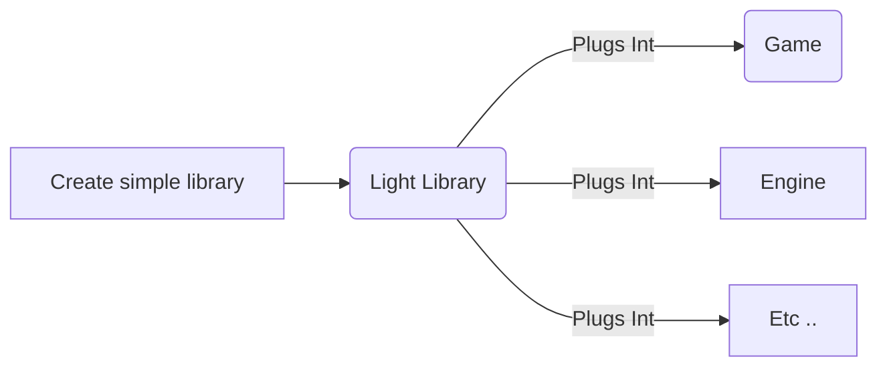

# This is Scnry

Scnry is a lightweight library I am developing for game asset management and overall scene serialization based solely on the YAML markup and using some already made YAML parsers Scnry uses  [jbeder's yaml-cpp ](https://github.com/jbeder/yaml-cpp) parser

//-- PS : you might face a problem while linking the library that it would look for the functions using __declspec(dllimport)
you'll have to specify that its a static link using #define YAML_CPP_STATIC_DEFINE

# Project Structure

**Yet to be Added**

### What I Hope for

